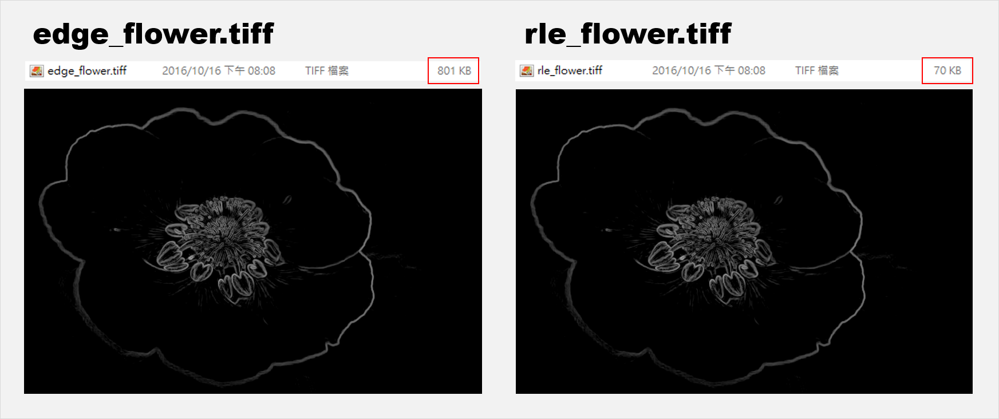

# Report: Project 1: Color Images, Edge Detection, and Run-Length Encodings
## Run on Bash
After finish PixImage.java, I ran this code to test itself.
```
$ javac PixImage.java
$ java PixImage
Testing getWidth/getHeight on a 3x3 image.
Input image:
000000, 1e1e1e, 505050,
0a0a0a, 787878, fafafa,
f0f0f0, fafafa, ffffff,
Good.
Testing blurring on a 3x3 image.
Good.
Good.
Good.
Testing edge detection on a 3x3 image.
Good.
Testing getWidth/getHeight on a 2x3 image.  Input image:
000000, 000000,
646464, 000000,
646464, 646464,
Good.
Testing blurring on a 2x3 image.
Good.
Testing edge detection on a 2x3 image.
Good.  
```
Then, after finish RunLengthEncoding.java, DoublyLinkedNode.java and RunIterator.java, I ran RunLengthEncoding to test itself.
```
$ javac RunLengthEncoding.java
$ java RunLengthEncoding
Testing one-parameter RunLengthEncoding constuctor on a 3x3 image.  Input image:
000000, 010101, 020202,
030303, 040404, 050505,
060606, 070707, 080808,
Testing getWidth/getHeight on a 3x3 encoding.
Good.
Testing toPixImage() on a 3x3 encoding.
Good.
Testing setPixel() on a 3x3 encoding.
Good.
Testing setPixel() on a 3x3 encoding.
Good.
Testing setPixel() on a 3x3 encoding.
Good.
Testing setPixel() on a 3x3 encoding.
Good.
Testing setPixel() on a 3x3 encoding.
Good.
Testing setPixel() on a 3x3 encoding.
Good.
Testing setPixel() on a 3x3 encoding.
Good.
Testing one-parameter RunLengthEncoding constuctor on another 3x3 image.  Input image:
020202, 020202, 030303,
030303, 040404, 040404,
050505, 050505, 060606,
Testing getWidth/getHeight on a 3x3 encoding.
Good.
Testing toPixImage() on a 3x3 encoding.
Good.
Testing setPixel() on a 3x3 encoding.
Good.
Testing setPixel() on a 3x3 encoding.
Good.
Testing one-parameter RunLengthEncoding constuctor on a 5x2 image.  Input image:
000000, 010101, 020202, 030303, 040404,
050505, 060606, 070707, 080808, 090909,
Testing getWidth/getHeight on a 5x2 encoding.
Good.
Testing toPixImage() on a 5x2 encoding.
Good.
Testing setPixel() on a 5x2 encoding.
Good.
Testing setPixel() on a 5x2 encoding.
Good.
Testing setPixel() on a 5x2 encoding.
Good.
Testing one-parameter RunLengthEncoding constuctor on a 3x2 image.  Input image:
000000, 010101, 020202,
030303, 040404, 050505,
Testing getWidth/getHeight on a 3x2 encoding.
Good.
Testing toPixImage() on a 3x2 encoding.
Good.
Testing setPixel() on a 3x2 encoding.
Good.
Testing setPixel() on a 3x2 encoding.
Good.
Testing setPixel() on a 3x2 encoding.
Good.
```
You need to install two packages to complete this project, jai_codec.jar and jai_core.jar. In windows, there has a easy method: just put the two packages into "C:\Program Files\Java\jdk1.8.0_101\jre\lib\ext\" and "C:\Program Files\Java\jre1.8.0_101\lib\ext\".

And then here is the final whole test.
```
$ javac Test.java
$ java Test
Beginning Part I.
Performing 5 boxBlur(1) calls, then one boxBlur(3) calls on a 11x15 image.
  Test successful.

Performing a sobelEdges call on feathers.tiff.
  Reading feathers.tiff.
  Test successful.

Total Part I score:  8 out of 8.
Total Autogradable score so far:  8 out of 8.

Beginning Part II.
Performing a 4x4 RunLengthEncoding-to-PixImage test.
  Calling the six-parameter constructor.
  Reading back the encoding through nextRun.
  Calling toPixImage.
  Test successful.

Total Part II score:  5 out of 5.
Total Autogradable score so far:  13 out of 13.

Beginning Part III.
Run-length encoding a PixImage.
  Reading highcontrast.tiff.
  Calling the one-parameter RunLengthEncoding constructor.
  Converting back to a PixImage.
  Test successful.

Total Part III score:  4 out of 4.
Total Autogradable score so far:  17 out of 17.

Beginning Part IV.
Setting pixels in your 4x4 run-length encoding (from Part II).
  Setting (3, 2) to [red=5, green=10, blue=136].
  Setting (0, 3) to [red=5, green=10, blue=136].
  Setting (1, 0) to [red=1, green=18, blue=42].
  Setting (2, 0) to [red=1, green=18, blue=42].
  Setting (0, 0) to [red=1, green=18, blue=42].
  Test successful.

Total Part IV score:  2 out of 2.
Total Autogradable score:  19 out of 19.

(Note:  1 hand-graded point will be for your check() method.)
```
Ha!Ha! I got full marks on this project. Well, this is an interesting part. Prof. Jonathan Shewchuk used a code to automatically give a mark. And then the most interesting part come in.
```
$ javac Blur.java
$ java Blur flower.tiff 10
Reading image file flower.tiff
Blurring image file.
Writing blurred image file blur_flower.tiff
Displaying input image and blurred image.
Close the image to quit.
```
And your screen will boom out this.
  
Blur.class has two arguments. First one is a file you want to blur, and second one is an iteration number of blurring. Try another interesting part.
```
$ javac Sobel.java
$ java Sobel flower.tiff 10 false
Reading image file flower.tiff
Blurring image file.
Writing blurred image file blur_flower.tiff
Performing Sobel edge detection on image file.
Writing grayscale-edge image file edge_flower.tiff
Writing run-length encoded grayscale-edge image file rle_flower.tiff
Displaying input image, blurred image, and grayscale-edge image.
Close the image to quit.
```
  
Sobel.class has three arguments. First one still is a file you want to blur, and second one still is an iteration number of blurring. And the third one is switch of turning Run_Lengths Encoding. I turn off here. This code show out three picture, the first one is original picture, second one is the blurred picture, and third one is a result of Sobel method on the blurred picture. Sobel method is a method to detect edge in pictures. So, the more I blur pictures, the less distinct on edge results of Sobel method. Show this by our testing,
  
```
$ java Sobel flower.tiff 0 true
Reading image file flower.tiff
Performing Sobel edge detection on image file.
Writing grayscale-edge image file edge_flower.tiff
Writing run-length encoded grayscale-edge image file rle_flower.tiff
Displaying input image and grayscale-edge image.
Close the image to quit.
```
This time, I turn on Run-Lengths Encoding which is one of methed of picture compression and can be implemented on *.tiff. Let see what happen on size of pictures.
  
rle_flower.tiff which is the result of Run-Lengths Encoding has little size than the other.
## Instruction
TBC